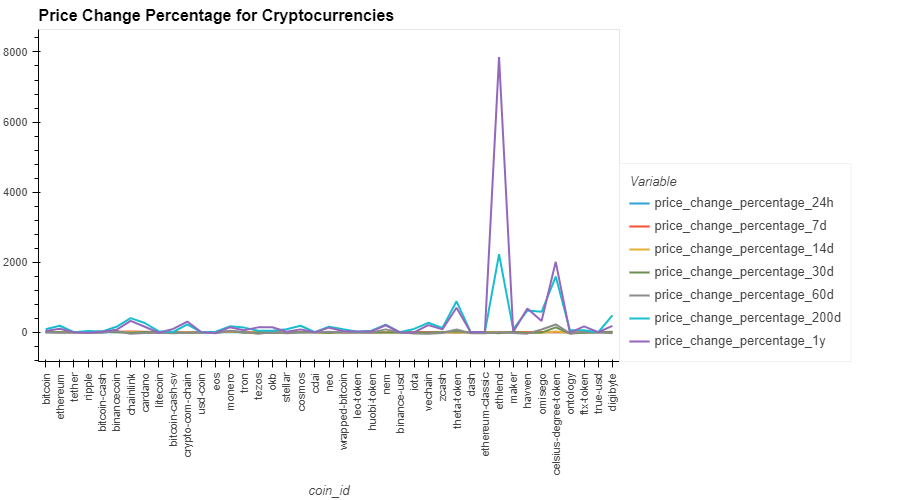
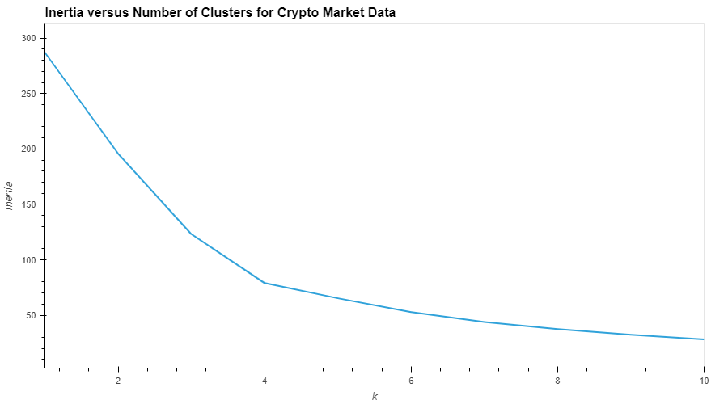
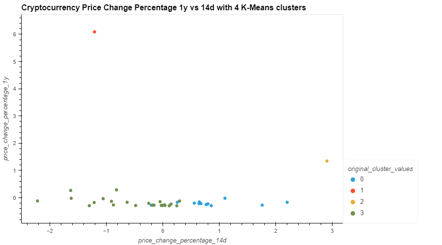
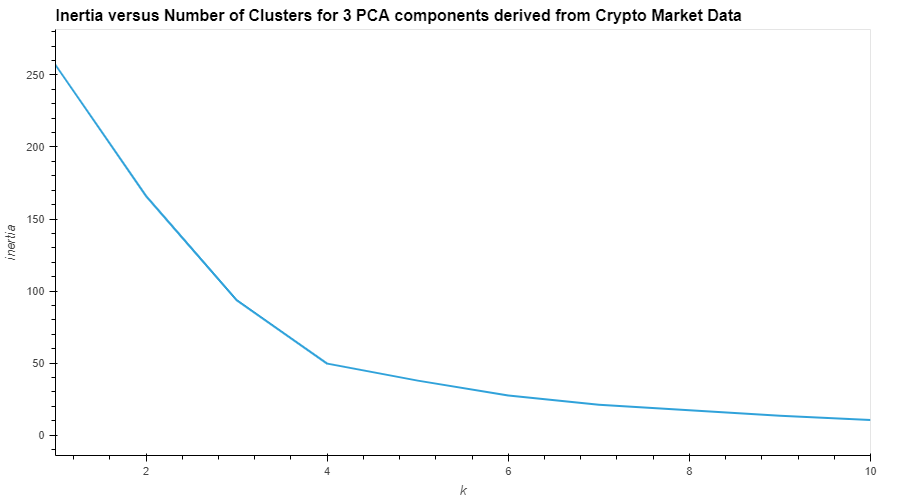
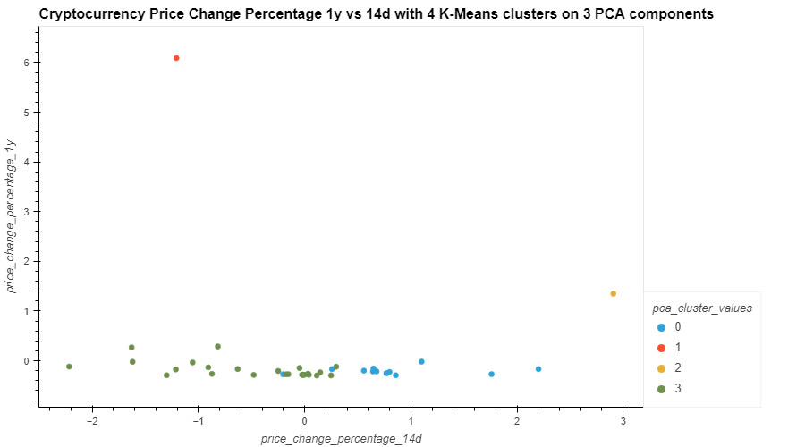
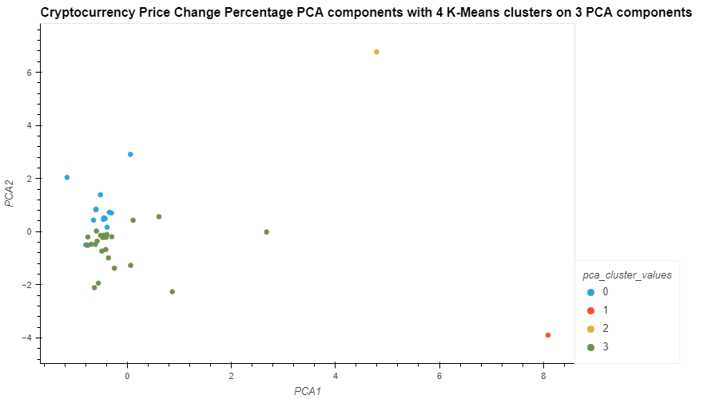

# Prototype for submitting crypto portfolio proposal.

In this Challenge, we combined our financial Python programming skills with the new unsupervised learning skills that we acquired in the 10th module.

We created a Jupyter notebook that clusters cryptocurrencies by their performance in different time periods. Then plot the results so that you can visually check the performance to the board.

The CSV file that’s provided for this Challenge contains the price change data of cryptocurrencies in different periods.



This indicates that a k value of 4 is optimal when we use the original features



Analysis of K-means clusters with k=4 using Percentage Change over 1y vs 14d



This indicates, similar to k means clustering on original features, that a k value of 4 is optimal when we reduced the original features to 3 using PCA.



Analysis of K-means clusters with k=4 using Percentage Change of 1y vs 14d



Analysis of K-means clusters with k=4 using Principal Components 1 and 2



---

## Technologies

This project uses python 3.7 along with the following packages:

* [JupyterLab](https://jupyterlab.readthedocs.io/en/stable/) - Web based user interface for data analysis.

* [pandas](https://github.com/pandas-dev/pandas) - Data analysis and manipulation library.

* [sklearn](https://github.com/scikit-learn/scikit-learn) - Python module for machine learning built on top of SciPy.

* [hvplot](https://hvplot.holoviz.org/) - Provides a general and consistent API for plotting data.

---

## Installation Guide

Please install the following before starting the application

```python
  pip install pandas
  pip install sklearn
  pip install hvplot
  pip install jupyterlab
```

---

## Usage

To use the Application, download and open the **crypto_investments.ipynb** 

---

## Contributors

Grigory Timofeev

[E-mail](fintech_github_challenge10@unloca.com)

---

## License

The MIT License (MIT)

Copyright (c) 2022 Grigory Timofeev

Permission is hereby granted, free of charge, to any person obtaining a copy of this software and associated documentation files (the "Software"), to deal in the Software without restriction, including without limitation the rights to use, copy, modify, merge, publish, distribute, sublicense, and/or sell copies of the Software, and to permit persons to whom the Software is furnished to do so, subject to the following conditions:

The above copyright notice and this permission notice shall be included in all copies or substantial portions of the Software.

THE SOFTWARE IS PROVIDED "AS IS", WITHOUT WARRANTY OF ANY KIND, EXPRESS OR IMPLIED, INCLUDING BUT NOT LIMITED TO THE WARRANTIES OF MERCHANTABILITY, FITNESS FOR A PARTICULAR PURPOSE AND NONINFRINGEMENT. IN NO EVENT SHALL THE AUTHORS OR COPYRIGHT HOLDERS BE LIABLE FOR ANY CLAIM, DAMAGES OR OTHER LIABILITY, WHETHER IN AN ACTION OF CONTRACT, TORT OR OTHERWISE, ARISING FROM, OUT OF OR IN CONNECTION WITH THE SOFTWARE OR THE USE OR OTHER DEALINGS IN THE SOFTWARE.
